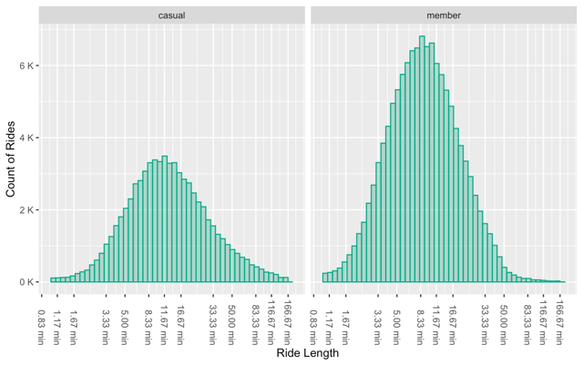

# 2023 Cyclistic Case Study

This is the case study of Cyclistic for 2023 that was done as part of Google’s Data Analytics Certificate course.
## Links
1. The data was downloaded from here: [Data Source](https://divvy-tripdata.s3.amazonaws.com/index.html)
2. All the raw R programming code can be found in this repository. [Raw R Code](https://github.com/mangonerd/2023-cyclistic-case/blob/main/raw_r_code.R)
3. The Tableau dashboard can be found here: [Tableau Dashboard](https://public.tableau.com/shared/J554PR5P6) (Unfortunately, github does not allow directly embedding the dashboard)
## Summary
**The case** is about a ride sharing company that is focused on bicycles. They are trying to convert their casual riders into registered members in order to increase revenue.
**Problem:** The riders are not signing up for the membership.
**Objective:** To increase revenue.

We can see from analyzing the data that **Members** are mainly using the service to commute, showing peak usage around 9AM and 5PM. While **Casual** users to a limited extent uses the service to commute, but the majority of them use the service during weekends around afternoons for leiserly rides along the coast. My recommendation are therefore as follows:
1. Come up with compelling offers and ads to show casual users the benefits of becoming a member.
2. Target the casual users during weekend around the peak time to encourage them to use Cyclistic for commuting.
3. Target the casual users during workdays around the commuting times to encourage becoming members.

Further studies can be done in the following areas:
1. Tracking user IDs to find behavior patterns of members and casuals.
2. Monitoring the effects of advertisements and making changes accordingly.

## Table of Contents

1.  [Introduction](#introduction)
    1. [importing data](#importing-data)
    2. [Exploring the Data](#exploring-the-data)
2. [Analysis](#analysis)
3. [Conlusion](#conclusion)

## Introduction

### Importing data
The packages used are: `tidyverse`, and `scales`. Specifically `dplyr`, `ggplot2`, and `readr` was used from `tidyverse`. 
Firstly, I downloaded the data (inside a subfolder named Data in the working directory) and imported it into Rstudio using the following code:
```{r import files}
df_ori <- list.files(path = "./Data", pattern = "*.csv", full.names = TRUE) %>%
  lapply(read_csv) %>%
  bind_rows()
```
This code automatically scans for all `.csv` files within the Data folder and combines them into a dataframe named `df_ori`.

### Exploring the data
Now to get an idea about the data, we can use various functions:
``` {r getting an idea of the data}
summary(df_ori)
colnames(df_ori)
colSums(is.na(df_ori)) #how many NA values in each columns
unique(df_ori$rideable_type) #seeing unique values
unique(df_ori$member_casual)
```
Interestingly through my exploration, I found some observations where ride **Start Time** was greater than **End Time**, which basically means the ride ended even before it started. (😆)
The case study is only about human users. So, these miraculous riders had to go.
```
df_pop <- filter(df_ori, started_at<ended_at)
```

At this point, I created a sample for ease of analysis, especially for Tableau. The sample size is 200,000, which is much larger than the 16k that is required for this population to have a 99% Confidence level and 1% Margin of error.
Code:
```
df <- sample_n(df_pop, 200000)
```

Writing a `.csv` file for Tableau with the sample:
```
write_csv(df, "2023_Cyclistic_Cleaned.csv")
```

## Analysis
Now comes the fun part. Firstly, I created 2 new columns for calculating the weekday and the ride length.
Code:
```
# Calculating the weekday of start date (started_at_weekday)
df$started_at_weekday <- wday(df$started_at, label = TRUE, abbr = FALSE, week_start = 1)

# Calculating the total ride time (ride_len)
df$ride_len <- difftime(df$ended_at, df$started_at, units = "secs")
```

**36%** of the riders are `casual` while the remaining **64%** are members. If we look at the bar graph of total rides in the weekdays for `casual` and `member`, we can see that there is a tendency for `casual` riders to increase through the week to finally the maximum during weekends. For `member` riders however, weekdays seem to be more up their alley.


<details>
  <summary>Click to see code</summary>
  
```{r generating plot rides weekdays}
#Calculating percentage of membership
df %>% 
  group_by(member_casual) %>%
  summarise(count = n()) %>% 
  mutate(per = 100*count/sum(count))

#generating the graph
df %>% 
  ggplot() +
  geom_bar(aes(started_at_weekday, fill = member_casual))+
  facet_wrap(~member_casual)+
  scale_y_continuous(labels = unit_format(unit = "K", scale = 1e-3))+
  theme(axis.text.x = element_text(angle = 45, hjust = 1))+
  labs(x = "Weekday", y = "Count of Rides", fill = "User Type")
```
</details>


Here is a histogram of the ride length. The scale is in log10, and the data was filtered to discard outliers.


<details>
  <summary>Click to see code</summary>
```{r generating histogram of ride length}
 df %>%
  filter(ride_len < 10000 & ride_len > 60) %>% # Filtering out extremes
  ggplot() +
  geom_histogram(aes(x=as.numeric(ride_len)), bins = 50, fill = "#00aa8855", color = "#00aa88")+
  facet_wrap(~member_casual)+
  scale_y_continuous(labels = unit_format(unit = "K", scale = 1e-3))+
  scale_x_log10(labels = unit_format(unit = "min", scale = 1/60), n.breaks = 15)+
  theme(axis.text.x = element_text(angle = -90, hjust = 1, vjust = 0.5))+
  labs(x = "Ride Length", y = "Count of Rides")
```
</details>

As we can see from the histogram, the ride length is more or less the same among the users, albeit the casual riders seem to ride for longer, possibly because they focus on enjoying the ride as a recreational activity.

With all this context, we need to as 2 simple questions to make sure our ads are having the most effect. **Where?** and **When?**. I turn to Tableau to answer these questions: [Tableau Dashboard](https://public.tableau.com/shared/J554PR5P6)

From the tableau dashboard, we can see the hotspot of the riders, where they tend to start and where they tend to get off.


Moreover, we can see which time in what day of the week they go for rides. Since we established earlier that the ride length is only around 11 minutes, using either the starting time or ending time should lead to the same result.
The area and time with more density should be targeted. For weekends, the afternoon should be targeted, and for weekdays, around 5PM is ideal— both scenarios are for targeting `casual` riders.

# Conclusion
So, targeting the casual riders during afternoons of weekends, and commuting time during weekdays is the best approach to have the most reach among our target audience. This can be done through digital ads, posters, banners etc. Exact channel needs to be determined after further study of the target group.


Thank you for reading through this long study. Feel free to reach out to me over on [Linkedin!](https://www.linkedin.com/in/mirzaangon/)
